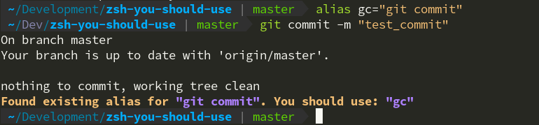
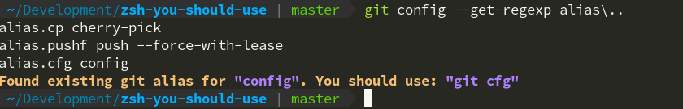

You Should Use
==============

|CircleCI| |Version| |GPLv3|

Simple zsh plugin that reminds you that you should use one of your
existing aliases for a command you just typed.

Also supports detection of global and git aliases.

* Usage_
* Requirements_
* Installation_
* `Message Position`_
* `Displaying Results`_
* `Customising Messages`_
* `Hardcore Mode`_
* `Check your Alias usage`_
* `Permanently Disabling Aliases`_
* `Temporarily Disabling Messages`_
* Contributing_
* `Running Tests`_

You can also view the CHANGELOG_ for a history of changes.

Usage
-----

You dont need to do anything. Once it's installed,
``zsh-you-should-use`` will let you know if you wrote a command with an
existing alias.

``you-should-use`` also detects global aliases:

.. image:: img/global.png

and Git aliases:

Requirements
------------

``you-should-use`` officially supports zsh versions 5.1 onwards.

It is possible the plugin might work on even older versions.
However they would not have been tested as part of the CI test process.

Installation
------------

Add one of the following to your ``.zshrc`` file depending on your
package manager:

ZPlug_

::

    zplug "MichaelAquilina/zsh-you-should-use"

Antigen_

::

    antigen bundle "MichaelAquilina/zsh-you-should-use"

Zgen_

::

    zgen load "MichaelAquilina/zsh-you-should-use"

oh-my-zsh_

Copy this repository to ``$ZSH_CUSTOM/custom/plugins``, where ``$ZSH_CUSTOM``
is the directory with custom plugins of oh-my-zsh `(read more) <https://github.com/robbyrussell/oh-my-zsh/wiki/Customization/>`_:
::

    git clone https://github.com/MichaelAquilina/zsh-you-should-use.git $ZSH_CUSTOM/plugins/you-should-use

Then add this line to your ``.zshrc``. Make sure it is **before** the line ``source $ZSH/oh-my-zsh.sh``.

::

    plugins=(you-should-use $plugins)

`Arch Linux`_

Install the ``zsh-you-should-use`` (AUR_) package::

    yaourt -S zsh-you-should-use

Then add this line to your ``.zshrc``::

    source /usr/share/zsh/plugins/zsh-you-should-use/you-should-use.plugin.zsh

Message Position
----------------

By default, ``you-should-use`` will display its reminder message *before*
a command has executed. However, you can choose to display the mesasge *after* a
command has executed by setting the value of ``YSU_MESSAGE_POSITION``.

::

    export YSU_MESSAGE_POSITION="after"

Displaying Results
------------------

By default, ``you-should-use`` will display the best match from any
matching aliases found. However, you can change this behaviour so that
it displays *all* matches found by setting the value of ``YSU_MODE``.

-  To only display best match (default): ``export YSU_MODE=BESTMATCH``
-  To display all matches: ``export YSU_MODE=ALL``

Customising Messages
--------------------

By default, the following message is displayed in bold when an alias is found:

::

    Found existing %alias_type for "%command". You should use: "%alias"

Where the following variables represent:

* ``%alias_type`` - the type of alias detected (alias, git alias, global alias)
* ``%command`` - the command that was typed by the user
* ``%alias`` - the matching alias that was found

This default message can be customised by setting the ``YSU_MESSAGE_FORMAT`` environment variable.

If for example, you wish to display your own custom message in red, you can add the
following to your ``~/.zshrc``:

::

    export YSU_MESSAGE_FORMAT="$(tput setaf 1)Hey! I found this %alias_type for %command: %alias$(tput sgr0)"

``$(tput setaf 1)`` generates the escape code terminals use for red foreground text. ``$(tput sgr0)`` sets
the text back to a normal color.

You can read more about how you can use tput and terminal escape codes here:
http://wiki.bash-hackers.org/scripting/terminalcodes

Hardcore Mode
-------------

**For the brave and adventerous only** :godmode:

You can enable Hardcore mode to enforce the use of aliases. Enabling
this will cause zsh to refuse to execute commands you have entered if an
alternative alias for it exists. This is a handy way of forcing you to
use your aliases and help you turn those aliases into muscle memory.

Enable hardcore mode by setting the variable ``YSU_HARDCORE`` to 1.

::

    export YSU_HARDCORE=1

Now if you type a command that has an alias defined and you didnt use
it, zsh will refuse to execute that command:

::

    $ export YSU_HARDCORE=1
    $ ls -lh
    Found existing alias for "ls -lh". You should use: "ll"
    You Should Use hardcore mode enabled. Use your aliases!
    $ ll
    total 8.0K
    -rw-r--r-- 1 michael users 2.4K Jun 19 20:46 README.md
    -rw-r--r-- 1 michael users  650 Jun 19 20:42 you-should-use.plugin.zsh

Check your Alias usage
----------------------

It's often useful to check how often we use our aliases so that we have an idea of which ones we
could probably get rid of (or remind ourselves of them if we forgot). ``zsh-you-should-use`` provides
a convenience function ``check_alias_usage`` which you can run to analyse your alias usage.

::

    $ check_alias_usage
    924: curl='curl --silent'
    652: gco='git checkout'
    199: json='jq '.' -C'
    157: less='less -R'
    100: ll='ls -lh --group-directories-first'
    93: vim='nvim'
    76: watch='watch '
    61: v='vim'
    60: md='mkdir'
    39: gr='git rebase'
    38: dc='docker-compose'
    35: ls='ls --color=auto'
    33: h='history'
    28: dcr='docker-compose

``check_alias_usage`` analyses your history to generate this data for you. If your history is disabled
or if you limit your history to a certain amount of time, then the alias report generated will be a reflection
of the limited data available.

Optionally, you can limit how far ``check_alias_usage`` looks back in history by providing an optional numeric
parameter. This parameter specifies how many entries in the history to check when generating the report.
In the example below, history is limited to the last 200 entries when generating the alias report.

::

    $ check_alias_usage 200
    9: h='history'
    3: gpoh='git push -u origin HEAD'
    3: gco='git checkout'
    2: v='vim'
    2: ll='ls -lh --group-directories-first'
    2: gpohw='gpoh && git web --pull-request'
    2: gc='git commit'
    2: gap='git add -p'
    2: ap='ansible-playbook'
    1: xopen='GDK_BACKEND=wayland xdg-open'
    1: t='tig'
    1: gw='git web'
    1: gs='git status'

Permanently Disabling Aliases
-----------------------------

You can permanently disable aliases by including them in the ``YSU_IGNORED_ALIASES`` variable (which is an array):

::

  $ ls -l
  Found existing alias for "ls -l". You should use: "ll"

  $ export YSU_IGNORED_ALIASES=("g" "ll")
  $ ls -l

If you want to ignore global aliases, use the ``YSU_IGNORED_GLOBAL_ALIASES`` environment variable.

::

  $ cd ../..
  Found existing global alias for "../..". You should use: "..."

  $ export YSU_IGNORED_GLOBAL_ALIASES=("...")
  $ cd ../..

Temporarily Disabling Messages
------------------------------

You can temporarily disable you should use by running the command ``disable_you_should_use``.

When you want to re-enable messages, run the command ``enable_you_should_use``.

Contributing
------------

Pull requests and Feedback are welcome! :tada:

I have tried to cater for as many use cases that I can think of.
However, they are naturally tailored to to my own workflow and I could
be missing many others.

Because of this if there is a specific use case that does not work as
you would expect or if you have any suggestions to how the plugin should
behave, feel free to `open an
issue <https://github.com/MichaelAquilina/zsh-you-should-use/issues/new>`__

Running Tests
-------------

Install `zunit <https://zunit.xyz/>`__. Run ``zunit`` in the root
directory of the repo.

::

    $ zunit
    Launching ZUnit
    ZUnit: 0.8.2
    ZSH:   zsh 5.3.1 (x86_64-suse-linux-gnu)

    ✔ ysu message correct output
    ✔ ysu global message correct output
    ✔ ysu git message correct output

NOTE: It is required that you use a minimum zunit version of 0.8.2

NOTE: The tests that run move your git configuration to a temporary
location during the test process so that your user configuration does
not interfere with tests. This will be restored at the end of each test
so there is no risk in losing your settings. If for some strange reason
zunit crashes or does not restore your git configuration automatically,
all you need to do is run ``mv ~/.gitconfig.bak ~/.gitconfig``

.. _Zplug: https://github.com/zplug/zplug

.. _Antigen: https://github.com/zsh-users/antigen

.. _ZGen: https://github.com/tarjoilija/zgen

.. _oh-my-zsh: https://github.com/robbyrussell/oh-my-zsh

.. _Arch Linux: https://www.archlinux.org/

.. _AUR: https://aur.archlinux.org/packages/zsh-you-should-use/

.. _CHANGELOG: CHANGELOG.md

.. |GPLv3| image:: https://img.shields.io/badge/License-GPL%20v3-blue.svg
   :target: https://www.gnu.org/licenses/gpl-3.0

.. |CircleCI| image:: https://circleci.com/gh/MichaelAquilina/zsh-you-should-use.svg?style=svg
   :target: https://circleci.com/gh/MichaelAquilina/zsh-you-should-use

.. |Version| image:: https://badge.fury.io/gh/MichaelAquilina%2Fzsh-you-should-use.svg
   :target: https://badge.fury.io/gh/MichaelAquilina%2Fzsh-you-should-use
